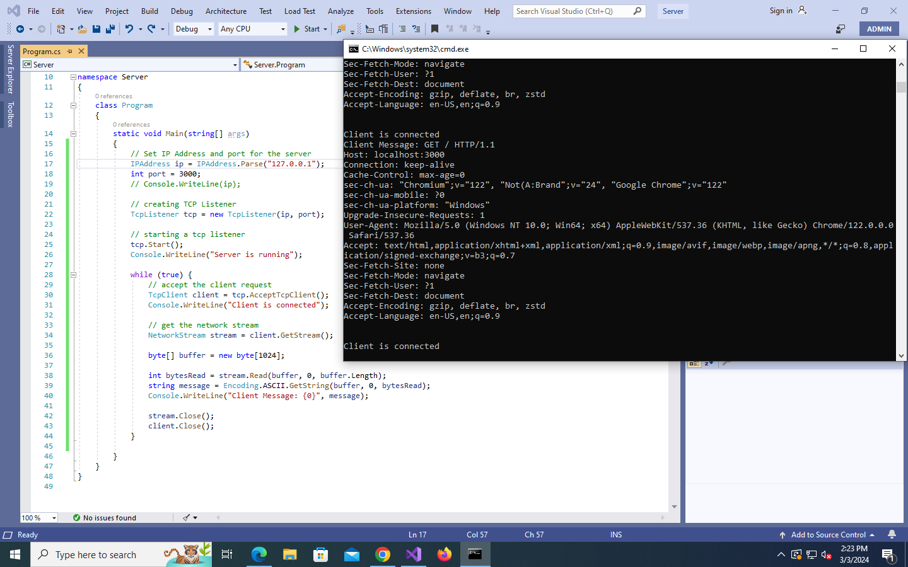

# Lab 2




```csharp
using System;
using System.Collections.Generic;
using System.Linq;
using System.Text;
using System.Threading.Tasks;
using System.Net;
using System.Net.Sockets;


namespace Server
{
    class Program
    {
        static void Main(string[] args)
        {
            // Set IP Address and port for the server
            IPAddress ip = IPAddress.Parse("127.0.0.1");
            int port = 3000;
            // Console.WriteLine(ip);

            // creating TCP Listener
            TcpListener tcp = new TcpListener(ip, port);

            // starting a tcp listener
            tcp.Start();
            Console.WriteLine("Server is running");

            while (true) {
                // accept the client request
                TcpClient client = tcp.AcceptTcpClient();
                Console.WriteLine("Client is connected");

                // get the network stream
                NetworkStream stream = client.GetStream();

                byte[] buffer = new byte[1024];

                int bytesRead = stream.Read(buffer, 0, buffer.Length);
                string message = Encoding.ASCII.GetString(buffer, 0, bytesRead);
                Console.WriteLine("Client Message: {0}", message);

                // closing stream and server
                stream.Close();
                client.Close();
            }

        }
    }
}

```